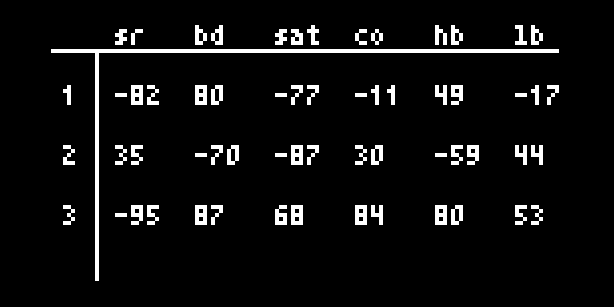
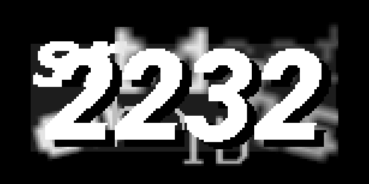

# d

d is for distortion, decimation, and destruction.. or whatever

### quick start
* put nice sound in
* twist knobs until it sounds awful, or awesome

## what's happening?

d is made up of two parts; an engine providing bit crushing and sample rate reduction as well as tape style distortion/saturation, and a randomized control matrix.

the control matrix is randomized each time you launch d, so there's lots of variation in the sounds produced by turning a knob. in addition to the matrix, you can also perform some special actions using the norns keys.

### nice numbers

holding **key1** enters command mode. use **keys 2/3** to input numbers. releasing **key1** will input the command.
note, the first two numbers are the same for related commands:

(22 - reset)
* 2222 - reset decimator
* 2223 - reset distortion
* 2232 - reset control matrix

(23 - set sweetspots)
* 2322 - set sweetspot 1
* 2323 - set sweetspot 2

(32 - recall sweetspots)
* 3222 - recall sweetspot 1
* 3223 - recall sweetspot 2

(33 - change screen view)
* 3322 - main/home screen
* 3323 - show engine parameter values
* 3332 - show the control matrix
